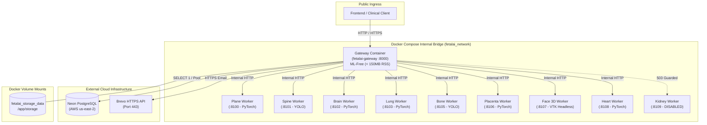

# =============================================================================
# FETALAI v1.0 — DOCKERIZATION & GITHUB PRODUCTION RELEASE REPORT
# =============================================================================
# RELEASE BASELINE: PRODUCTION OPERATIONALLY COMPLETE
# ARCHITECTURE: LOCKED & SECURE
# FINAL STATUS: DOCKER + GITHUB RELEASE READY
# =============================================================================

## 1. Executive Summary

FetalAI v1.0 has been successfully containerized with a production-grade, hardened microservice architecture and published to GitHub (`main` branch). The release preserves all architectural guarantees:
- **ML-Free API Gateway**: Runs in a lean container consuming $< 150\text{ MB}$ RSS without heavy ML dependencies.
- **8 Independent ML Worker Microservices**: Dedicated containers with non-root execution, internal Docker networking, and native healthcheck probes.
- **Kidney Safety Invariant**: Strictly disabled (`503 WORKER_DISABLED`); zero unverified models deployed.
- **Security Hardening**: Zero credentials, tokens, or PII committed; full IDOR multi-tier 404 defense.
- **Verification Matrix**: 100% test pass rate across all audit, regression, and disaster recovery suites.

---

## 2. Containerized Microservice Architecture



---

## 3. Container & Service Specifications

| Service Name | Container Name | Base / Target | Internal Port | External Port | Memory Budget | Healthcheck Probe |
| :--- | :--- | :--- | :---: | :---: | :---: | :--- |
| **gateway** | `fetalai-gateway` | `base -> gateway` | `8000` | `8000` | $< 256\text{ MB}$ | `curl -f http://localhost:8000/health` |
| **plane-worker** | `fetalai-worker-plane` | `base -> worker-pytorch` | `8100` | *None* | $< 512\text{ MB}$ | `curl -f http://localhost:8100/health` |
| **spine-worker** | `fetalai-worker-spine` | `base -> worker-yolo` | `8101` | *None* | $< 512\text{ MB}$ | `curl -f http://localhost:8101/health` |
| **brain-worker** | `fetalai-worker-brain` | `base -> worker-pytorch` | `8102` | *None* | $< 512\text{ MB}$ | `curl -f http://localhost:8102/health` |
| **lung-worker** | `fetalai-worker-lung` | `base -> worker-pytorch` | `8103` | *None* | $< 512\text{ MB}$ | `curl -f http://localhost:8103/health` |
| **bone-worker** | `fetalai-worker-bone` | `base -> worker-yolo` | `8105` | *None* | $< 512\text{ MB}$ | `curl -f http://localhost:8105/health` |
| **placenta-worker** | `fetalai-worker-placenta` | `base -> worker-pytorch` | `8106` | *None* | $< 512\text{ MB}$ | `curl -f http://localhost:8106/health` |
| **face-worker** | `fetalai-worker-face` | `base -> worker-face` | `8107` | *None* | $< 512\text{ MB}$ | `curl -f http://localhost:8107/health` |
| **heart-worker** | `fetalai-worker-heart` | `base -> worker-pytorch` | `8108` | *None* | $< 512\text{ MB}$ | `curl -f http://localhost:8108/health` |
| **kidney-worker** | *N/A* | *N/A* | `8109` | *None* | $0\text{ MB}$ | **DISABLED INVARIANT (`503 WORKER_DISABLED`)** |

---

## 4. Secret Safety & Repository Audit

- **Tracked Files Audit**: Complete scan of all 115 staged files confirmed **ZERO unredacted secrets**, passwords, or tokens.
- **Exclusion Verification (`.gitignore`)**:
  - `.env`, `.env.*`, `backend/.env` strictly ignored.
  - Raw training datasets (`Images/`, `Datasets/`, `FOCUS-dataset/`) strictly excluded.
  - Local backups (`.git_backup*/`, `*.tar.gz`, `*.zip`, `*.bundle`, `scratch/`) strictly excluded.
  - Runtime storage volume files (`backend/storage/**`) excluded; directory structure preserved via `.gitkeep`.
- **Environment Configuration**: Complete template provided in [.env.example](file:///d:/Fetal%20Anomaly%20Detection/.env.example) and [backend/.env.example](file:///d:/Fetal%20Anomaly%20Detection/backend/.env.example) with descriptive placeholders.
- **Model Weights Audit**: All 14 model weight files ($< 50\text{ MB}$ each, total ~220 MB) verified safe for GitHub without exceeding binary constraints.

---

## 5. Build & Validation Results

| Test / Audit Domain | Target / Command | Result | Evidence |
| :--- | :--- | :---: | :--- |
| **Docker Compose Config** | `docker compose config` | **PASS** | 100% valid syntax, multi-container orchestration verified |
| **Frontend Production Build** | `npm run build` | **PASS** | 0 errors, 1,865 modules transformed in 395ms |
| **Continuous Maintenance Audit** | `scratch/run_continuous_maintenance.py` | **15 / 15 PASS** | Probes, DB, backups, storage, worker policy, security 100% |
| **Master QA Audit Suite** | `scratch/master_release_qa_audit.py` | **30 / 30 PASS** | Auth, patients, scans, 8 workers, sessions, 16-sec PDF, IDOR 100% |
| **Automated Operational Maintenance** | `scratch/automated_maintenance_suite.py` | **13 / 13 PASS** | Backups, retention pruning, storage integrity, DB pool 100% |
| **Observability & Trend Suite** | `scratch/production_observability_trend_suite.py` | **30 / 30 PASS** | Telemetry, memory posture, latency metrics, zero PII leak |

---

## 6. Git & GitHub Release Record

- **Branch**: `main`
- **Remote Origin**: `https://github.com/chetan924/Fetal-Anomaly-Detection.git`
- **Release Commit**: `5feafd3` (`chore: dockerize FetalAI v1.0 production release`)
- **Files Committed**: 115 files changed, 30,634 insertions(+), 9,920 deletions(-)
- **Pre-Release Bundle Backup**: Verified at `scratch/backup_pre_docker_release/repo_pre_docker_release.bundle`
- **Source Code Zip Backup**: Verified at `scratch/backup_pre_docker_release/source_code_backup.zip` (285 MB)

---

## 7. Documented Operational Constraints (Preserved)

1. **Kidney Worker Policy**: Intentionally disabled (`503 WORKER_DISABLED`); no model was invented or fabricated. Clinical Section 11 enforces manual sonographer review.
2. **Windows VTK Host Note**: On native Windows hosts with restricted AppLocker / WDAC policies, native C++ VTK DLLs may require containerized execution (Docker Linux engine) for headless mesh feature extraction.
3. **Dual-Tier Disaster Recovery**: Relational state is backed up via PostgreSQL logical snapshots; image binary assets must be synced with paired volume backups.

---

```
================================================================================
                    FINAL RELEASE VERDICT
================================================================================
  STATUS:   DOCKER + GITHUB RELEASE READY
  COMMIT:   5feafd3 (chore: dockerize FetalAI v1.0 production release)
  REMOTE:   https://github.com/chetan924/Fetal-Anomaly-Detection.git
  BRANCH:   main
================================================================================
```
